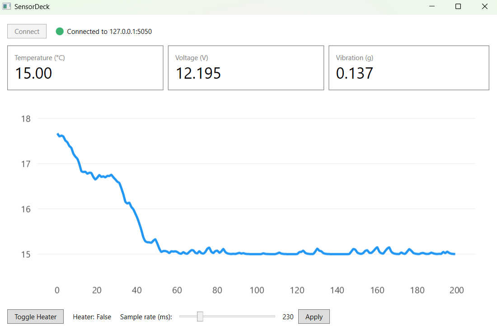

# SensorDeck

A WPF telemetry dashboard that connects to a simulated hardware device over TCP, streams live sensor readings (temperature, voltage, vibration), plots them in real time, and sends control commands back.

> Built to demonstrate: WPF/MVVM, async/await I/O, a Producer/Consumer pipeline (`System.Threading.Channels`), a TCP communication protocol, and xUnit unit + integration testing.



## Projects

- **`src/SensorDeck.Core`** — shared contracts: `TelemetryFrame`, `DeviceCommand`, JSON-line (de)serialization, and the async `DeviceConnection` TCP wrapper.
- **`src/DeviceSimulator`** — console app standing in for the real hardware. Listens on TCP port 5050, emits a `TelemetryFrame` as a JSON line every ~100ms, and reacts to inbound `DeviceCommand`s (toggle heater, set sample rate).
- **`src/SensorDeck.Wpf`** — the dashboard. MVVM (`MainViewModel` via CommunityToolkit.Mvvm), a Producer/Consumer `Channel<TelemetryFrame>` bridging the socket-read task and the UI thread, and a live-scrolling LiveCharts2 temperature chart.
- **`tests/SensorDeck.Core.Tests`** — xUnit: frame/command serializer round-trip and malformed-input handling, plus an integration test that spins up `TcpTelemetryServer` in-process and asserts frames flow through a real `DeviceConnection`.
- **`tests/SensorDeck.Wpf.Tests`** — xUnit: `MainViewModel` `PropertyChanged` notifications and command `CanExecute` gating on connection state.

## Running it

```
dotnet run --project src/DeviceSimulator
dotnet run --project src/SensorDeck.Wpf
```

Click **Connect** in the WPF window. You should see the three live readouts update, the temperature chart scroll, and the simulator log heater/sample-rate changes when you use the controls at the bottom of the window.

## Testing

```
dotnet test
```

## Swapping in real hardware

`DeviceSimulator` stands in for a networked device today. Because the wire protocol (newline-delimited JSON over TCP) and the shared `SensorDeck.Core` contracts are decoupled from the simulator's implementation, a real device only needs to speak the same JSON-line protocol — or `DeviceConnection` could be swapped for a `System.IO.Ports`-based serial transport for UART-connected hardware without touching the ViewModel or UI.
